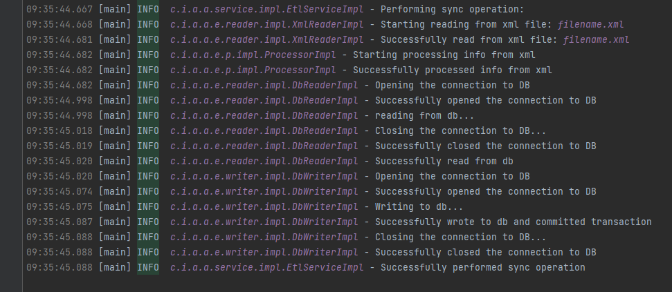

# Тестовое задание для IIS-SOFT

### Краткое описание:
Сервис, который позволяет выгрузить данные с БД в XML, а так же
синхронизировать БД по файлу XML. Сервис сам пройдется по XML и удалит
/ добавит / изменит записи в БД.

# Запуск
Перед тем как перейти к Bash-скрипту для запуска, нам понадобится:
1) Создать Базу Данных Postgres
2) #### Путь sql скрипта для создания таблицы и ёё заполнения: ```./scripts/script.sql```
3) ### **_Зайти в файл_** **!!!** ```entrypoint/application.properties``` **!!!** и **изменить данные** для входа в БД.
P.S изменить данные только там, а НЕ в src/main/resources, так как запускается джарник,
а файл пропертис который находится
в папке с ним переопределит тот, который находится в ресурсах.
4) #### Путь bash-скрипта ```./entrypoint/run-project.sh```
5) #### Пример Лог-файла ```./entrypoint/logs/log_2023-11-19.log```
6) #### Документация(Java-Doc) есть у каждого интерфейса над методами

### Функционал
Есть два режима работы программы: выгрузка в файл(upload) и синхронизация(sync)

Для запуска bash скрипта лучше перейти в директорию **entrypoint**
```cd entrypoint```

**и уже оттуда выполнять команды sync и upload**

### Выгрузка данных(upload):
```shell
 ./run-project.sh upload filename.xml
 ```

Выгружает все записи из БД в указанный файл, после выполнения файл будет находиться: ```./entrypoint/filename.xml```

Запись в XML файл осуществлен с помощью **XML DOM**

### Синхронизация данных(sync):
```shell
 ./run-project.sh sync filename.xml
```

Для синхронизации нужен уже существующий файл,
**лучше сначала сделать выгрузку, а потом что-то изменить в файле и проверить синхронизацию**

Синхронизирует все записи в БД с указанным файлом, файл должен находиться: ```./entrypoint/filename.xml```

Для синхронизации был использован HashMap для контроля натурального ключа

Чтение XML происходит с помощью **XML DOM**


### Пример лог-файла при выполнении команды sync



#### Пример лог-файла если у нас встретились два одинаковых натуральных ключа в XML-файле


#### Пример лог-файла если при синхронизации указан неверный файл


## Технологии
1) Spring
2) JDBC
3) PostgreSQL
4) XML DOM
5) Logback(для логгирования)
6) Lombok(для геттеров, сетторов, конструкторов) - equals, hashcode переопределял сам
7) JAVA DOC
